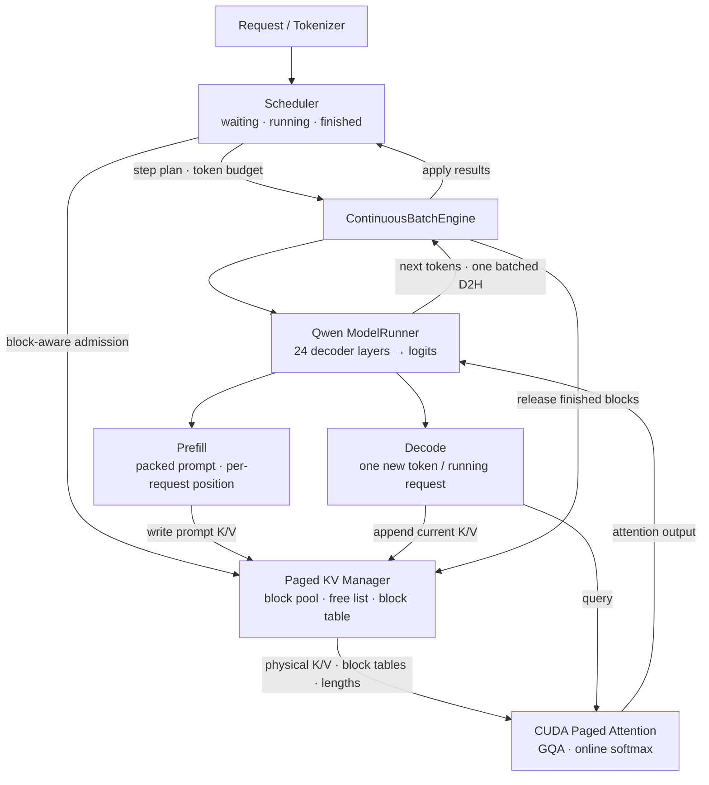

# Mini LLM Runtime

**从模型前向到请求调度，独立实现一个可验证的单 GPU LLM 推理引擎。**

A single-GPU LLM inference runtime built from scratch: Qwen ModelRunner, paged KV cache,
CUDA decode attention, and continuous batching.

[](https://github.com/Eran-ovo/mini-llm-runtime/releases/tag/v1.1.0)
[](#项目能力)
[](#快速开始)
[](#实测结果)

[项目能力](#项目能力) · [运行架构](#运行架构) · [实测结果](#实测结果) ·
[快速开始](#快速开始) · [源码导航](docs/reading-guide.md) ·
[正确性与证据](docs/evidence_index.md)

## 项目能力

在 **RTX 3060 Laptop 6 GB** 上运行 `Qwen/Qwen2.5-0.5B` FP16，
覆盖一次请求从入队、Prefill、逐 token Decode 到 KV 回收的完整生命周期。
模型计算由自有 ModelRunner 编排；Hugging Face 用作 tokenizer 与外部 correctness oracle。

| 层次 | 独立实现的能力 |
|---|---|
| **模型执行** | 直接加载 config/safetensors；自有 24 层 Qwen forward；RMSNorm、RoPE、QKV、GQA、SwiGLU、LM Head；显式 Prefill/Decode |
| **状态与显存** | 连续/Paged KV Cache；GPU block pool、CPU free list、每请求 block table；事务式追加、跨块增长、释放复用与 OOM 防护 |
| **CUDA Attention** | 手写 Decode Paged Attention：FP16、q_len=1、head_dim=64、GQA/MQA、非连续物理块、FP32 online softmax |
| **动态批处理** | 变长 packed Prefill、batched Decode、waiting/running/finished 状态机；Decode-priority 与 request/token/block budget |
| **验证与测量** | HF token/logits/KV 对拍；TTFT、TPOT、吞吐、尾延迟与显存；CUDA Event、raw samples、clean-tree release bundle |

底层 GEMM、Norm、RoPE 与 Prefill attention 使用 PyTorch/cuBLAS/SDPA。
Paged KV 写入提供 PyTorch scalar/vectorized 路径；手写 CUDA 核心是 Decode Attention。
这让模型正确性、存储生命周期和 CUDA 地址映射可以分别验证。

## 运行架构



- **Prefill**：处理有效 prompt token，创建各层 KV，产出首 token。
  `auto` 在 dense block-diagonal mask 与 segmented SDPA 之间按形状选择。
- **Decode**：逐请求 position 延续，只计算新 token；每层一次 batched Paged Attention，
  从 block table 读取历史 KV。
- **Continuous Batching**：每 step 移除完成请求，并用剩余预算接纳 waiting 请求。
  当前 Engine 同步执行 `Prefill → Decode → D2H → commit/release`。
- **Paged KV**：逻辑 token 与物理页解耦，完成时归还 blocks。
  Admission 保守预留请求整个生成生命周期所需 blocks，避免无抢占机制时中途 OOM。

KV 地址映射：

```text
logical_block = token_position // block_size
block_offset  = token_position % block_size
physical_block = block_table[request_id, logical_block]

K/V layout: [layer, physical_block, kv_head, block_offset, head_dim]
```

设计与验收见 [架构文档](docs/architecture.md)；
按真实源码跟读见 [源码导航](docs/reading-guide.md)。

## 实测结果

**统一硬件背景：RTX 3060 Laptop / Ampere sm_86 / 6 GB，WSL2 Ubuntu 22.04，
CUDA 12.4，PyTorch 2.6.0+cu124，Qwen2.5-0.5B FP16。**
以下来自既有正式 clean-tree benchmark，源码版本分别绑定到各自 commit。

### Continuous vs Static Batching

8-request burst；generation lengths 循环 `2,4,8,12`；
max running `4`，token budget `64`，block size `16`；
warmup `3`，measured `10`，逐轮交错并反转 case 顺序。
采样源码：[`d31ded2`](https://github.com/Eran-ovo/mini-llm-runtime/tree/d31ded234702d9f51d419d8c2d200e51c5994950)。

| 指标 | Static | Continuous | 相对变化 |
|---|---:|---:|---:|
| Throughput | 65.43 tok/s | **71.70 tok/s** | **+9.58%** |
| TTFT median | 334.78 ms | **178.08 ms** | **−46.81%** |
| E2E median | 478.58 ms | **414.06 ms** | **−13.48%** |
| TPOT median | **24.06 ms** | 25.56 ms | +6.23%（变慢） |

动态 refill 改善排队和总吞吐；mixed Prefill 同时会干扰已有请求 Decode，
因此 TPOT 有代价。TTFT/TPOT/E2E 使用 CPU 请求事件时间线，
CUDA Event 单独保存 GPU timeline，二者没有混用。
该固定 workload 的结果不外推为生产流量或相对其他推理框架的结论。

[数据与统计口径](docs/benchmarks/README.md) ·
[原始样本摘录](docs/benchmarks/static-continuous.json) ·
[v1.0.0 完整证据归档](https://github.com/Eran-ovo/mini-llm-runtime/releases/download/v1.0.0/mini-llm-runtime-v1.0.0-release-evidence.tar.gz)

### Prefill Attention Backend

4 个 512-token prompt；两条路径均使用 vectorized KV write，
**只改变 Attention backend**。warmup `2`，measured `6`。
采样源码：[`7f4c844`](https://github.com/Eran-ovo/mini-llm-runtime/tree/7f4c8444c34b78732775f8df86582e5c7f4075ce)。

| 指标 | Dense masked | Segmented SDPA | 降幅 |
|---|---:|---:|---:|
| Prefill ModelRunner + KV write median | 372.129 ms | **136.475 ms** | **63.3%** |
| Peak allocated memory | 1453.53 MiB | **1055.99 MiB** | **27.3%** |

测量不含 tokenizer、输入构造和 Scheduler，不能当作端到端 TTFT。
Segmented SDPA 是逐请求 attention 调用，共享 packed projection/MLP，
尚未实现 fused varlen attention。

[原始样本摘录](docs/benchmarks/prefill-4x512.json) ·
[Backend 原理与形状扫描](docs/prefill_attention_backends.md)

## 快速开始

已验证：Python 3.10、CUDA toolkit 12.4（含 `nvcc`）、GCC/G++ 11、
Ninja、PyTorch 2.6.0+cu124、RTX 3060 Laptop。
CUDA extension 首次使用时 JIT 编译，编译时间不进入 benchmark。

```bash
git clone https://github.com/Eran-ovo/mini-llm-runtime.git
cd mini-llm-runtime

python3 -m venv .venv
source .venv/bin/activate

python -m pip install --upgrade pip
python -m pip install torch==2.6.0 --index-url https://download.pytorch.org/whl/cu124
python -m pip install -e '.[dev]' ninja
python scripts/check_environment.py
```

### 验证 Runtime 主链路

```bash
# 单元与 CUDA 测试：不下载模型；CUDA/NVCC 不可用时相关测试会 skip。
python -m pytest -q

# 真实 Qwen + HF oracle：首次下载权重，覆盖动态进出队、跨块与回收。
python -m experiments.continuous_batch_engine_runner \
  --output-dir benchmarks/results/engine_correctness

# 变长 Prefill、晚到请求、显存压力等待、物理块复用与全部回收。
python scripts/check_engine_ragged_continuation.py \
  --block-pressure-reuse \
  --output-dir benchmarks/results/block_pressure_correctness
```

权重已缓存时可追加 `--local-files-only`。参考模型先释放，再加载自有 Runner，
降低 6 GB GPU 上的同时驻留开销。`Qwen2.5-0.5B` 是 base model，输出用于
推理路径验证，并非 chat/instruct 效果演示。

### 复现正式实验

```bash
# 从当前 HEAD 创建 detached clean worktree：
# tests → HF correctness → Static/Continuous → tail benchmark。
python scripts/run_release_evaluation.py \
  --output-dir benchmarks/results/release_local

# 独立复现 Prefill backend 对照。
python scripts/benchmark_packed_prefill.py \
  --fixed-prompt-length 512 \
  --compare-segmented-sdpa --compare-vectorized-kv-write \
  --warmup 2 --repeats 6 \
  --output-dir benchmarks/results/prefill_local
```

在当前 HEAD 复现得到的是当前版本结果；复核历史数字须使用对应 source commit。
完整参数与归档语义见 [Release Evaluation](docs/release_evaluation.md)。

## 正确性与工程质量

v1.1.0 的全量测试记录为 **280 passed**；
测试与真实模型 oracle 分开运行，避免普通回归依赖下载权重。

| 验证层次 | 覆盖重点 |
|---|---|
| 模型数学 | 权重映射、RoPE、GQA、单层/整模型 logits、greedy token |
| KV 生命周期 | reserve/write/commit、跨块追加、OOM 原子失败、double-free 防护、释放复用 |
| CUDA Attention | SDPA/Python reference、非连续物理块、变长 batch、GQA/MQA |
| 调度与 Engine | late admission、mixed step、token 行归属、outstanding batch、失败回滚 |
| 证据管理 | warmup、median、raw samples、峰值显存、环境、commit、clean-tree、SHA-256 |

**有价值的负结果也保留。** Mixed-prefill budget 限制改善部分 TPOT，
却损害吞吐和尾延迟，默认关闭；split-KV 的分区/合并开销与 profiler 边界
保存在实验文档。稳定入口不自动采用未经端到端验证的实验策略。

[证据索引](docs/evidence_index.md) ·
[正确性 Gate](docs/continuous_batch_correctness_gate.md) ·
[split-KV 实验](docs/split_kv_experiment.md) ·
[Mixed Prefill 取舍](docs/mixed_prefill_budget_benchmark.md)

## 源码与文档入口

```text
src/mini_llm_runtime/
  qwen_loader.py / qwen_model_runner.py    # 权重加载、24 层前向、Prefill/Decode
  paged_kv_cache.py / paged_kv_manager.py   # block pool、表、事务与生命周期
  scheduler.py / block_admission.py        # 状态机、预算与准入
  engine.py / request_metrics.py           # 编排、回收与请求时间线
csrc/                                     # PyTorch 绑定、Paged Attention CUDA
tests/                                    # 分层/边界/集成回归
scripts/                                  # 环境、正确性与正式 benchmark
experiments/                              # 教学、对拍与优化消融
docs/                                     # 架构、证据、教程和失败分析
```

- **快速读懂项目**：[源码导航与阅读路线](docs/reading-guide.md)。
- **学习实现过程**：[分阶段开发指南](docs/development-guide.md)。
- **理解系统数据流**：[交互式可视化源码](docs/vllm_runtime_flow.html)。
- **从基础到代码**：[13 页 HTML 教程](docs/tutorial/index.html)。

HTML 文档可在本地直接打开，或从仓库根目录运行 `python -m http.server 8000`，
访问 `http://localhost:8000/docs/tutorial/`。GitHub 文件页提供源码浏览。

## 当前边界与后续方向

单 GPU、FP16、greedy；Decode CUDA kernel 当前支持 `head_dim=64`，
以正确性优先，sequence 维仍串行扫描。
同步 Engine 采用 whole-prefill、strict FIFO 和保守全生命周期 block reservation。
尚不支持 chunked prefill、preemption、异步 CPU/GPU overlap、prefix caching、
量化、分布式推理或 Speculative Decoding。

后续优先建立 Paged Decode 的分层 profile 与优化闭环，
再研究 chunked prefill 和增量 KV admission。所有收益都须重新通过
correctness 和正式 benchmark。

**相关项目**：[CUDA Operators](https://github.com/Eran-ovo/Ai-infra) —
Tensor Core GEMM、FlashAttention 与 Norm 算子的手写实现及 Nsight Compute 优化证据。
